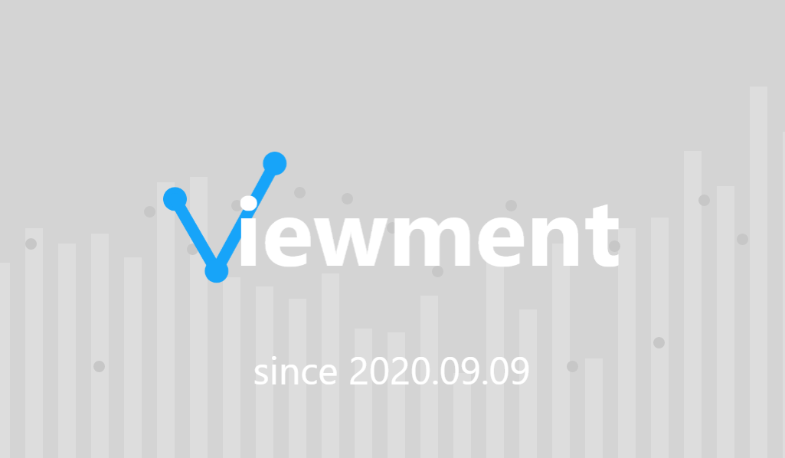
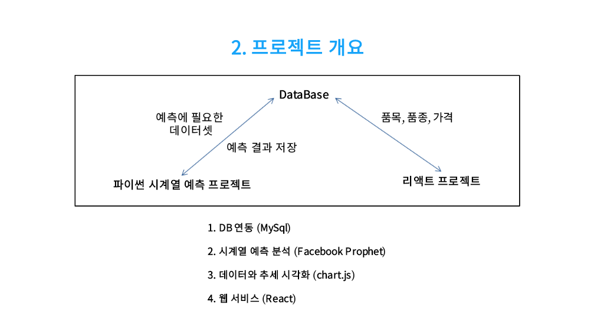
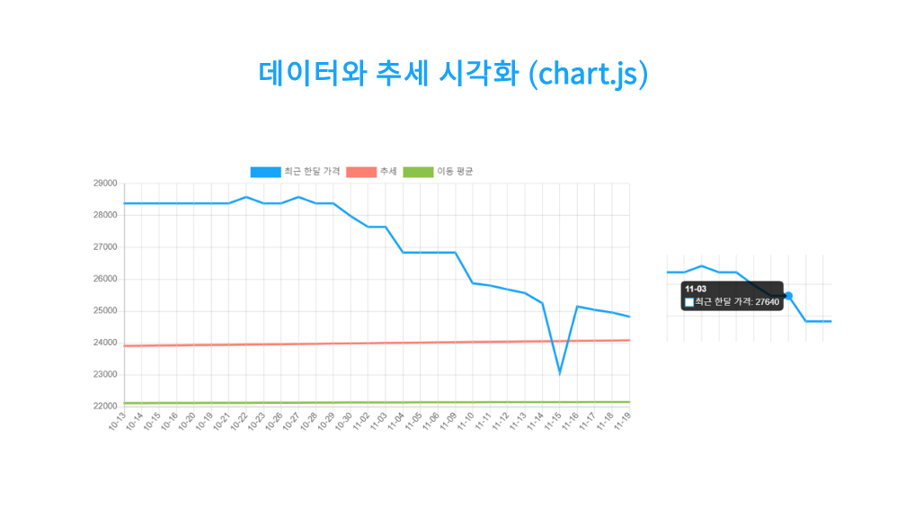

# Viewment

    Facebook Prophet 예측 모델을 사용해 미래 5일의 가격을 예측하는 리액트 웹 서비스

## 개요

1. 테이블의 데이터에서 Facebook Prophet 모델을 이용해 예측
2. 예측값을 그 테이블에 저장
3. 웹에서 선택한 품목에 해당하는 테이블 순회
4. 데이터의 일부를 이용해 경향을 그리는 그래프 표시
5. 날짜-가격 및 경향 차트로 표현

    서버사이드렌더링(Express, Webpack) - CORS에러(MySQL의 테이블 접근) 해결
    인공지능 프로젝트는 리포지토리에 포함되어 있지 않음

## 기술 스택

-   인공지능
    -   Facebook Prophet
    -   Arima (비교)
-   웹
    -   ES6
    -   React
    -   Express
    -   Webpack
    -   Redux
    -   Chart.js
    -   SCSS
-   DB
    -   MySQL
-   기타
    -   R Studio(데이터 결측치 대체)

## 개발 인원 · 역할 · 기간

-   팀원 3명
-   역할
    -   인공지능 - 0%
    -   퍼블리싱 - 10%(약간의 수정)
    -   웹 파트 기능 - 100%
-   2개월 작업
